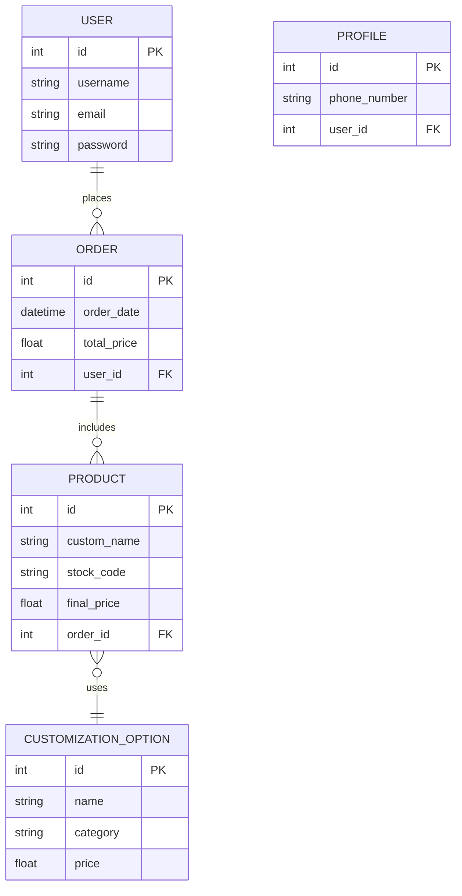

```mermaid
erDiagram
    USER {
        int id PK
        string username
        string email
        string password
    }

    PROFILE {
        int id PK
        string phone_number
        int user_id FK
    }

    ORDER {
        int id PK
        datetime order_date
        float total_price
        int user_id FK
    }

    PRODUCT {
        int id PK
        string custom_name
        string stock_code
        float final_price
        int order_id FK
    }

    CUSTOMIZATION_OPTION {
        int id PK
        string name
        string category
        float price
    }

    PRODUCT }o--|| CUSTOMIZATION_OPTION : "uses"
    USER ||--o{ ORDER : "places"
    ORDER ||--o{ PRODUCT : "includes"
```